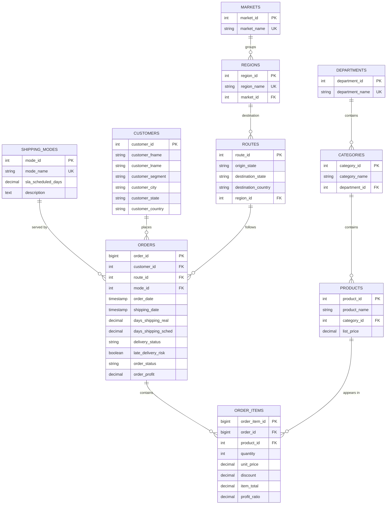

# DataCo Global - Entity Relationship Diagram

The 3NF schema for the Last-Mile Delivery Audit. Render this with any Mermaid-compatible viewer (GitHub, Mermaid Live Editor, or VS Code extension).

## Why these tables in 3NF

| Table | What it normalizes | What gets eliminated |
|---|---|---|
| `markets` | 5-value lookup (Africa, Europe, LATAM, Pacific Asia, USCA) | "Market" string repetition across every order row |
| `regions` | 23 sub-market regions | "Region" string repetition; transitive Region→Market dependency |
| `routes` | ~12K origin-destination pairs | Repeated origin/destination state pairs across orders |
| `shipping_modes` | 4-mode SLA lookup | SLA values that would otherwise be hard-coded per row |
| `customers` | 20K customers | Customer name/address repeated for every order they place |
| `categories` | Product taxonomy nested under departments | Department-name repetition across products |

## Row counts after load

| Table | Rows |
|---|---:|
| markets | 5 |
| regions | 23 |
| shipping_modes | 4 |
| departments | 11 |
| categories | 51 |
| products | 118 |
| customers | 20,652 |
| routes | 11,899 |
| **orders** | **65,752** |
| **order_items** | **180,519** |

The 180,519 `order_items` are the rows of the source CSV — each row is one product line, but multiple lines belong to the same `order_id`. This was the most important normalization step: 65,752 unique orders, not 180,519.

## Note on Routes / Vehicles / Fuel_Logs

The brief asks for `Routes`, `Vehicles`, and `Fuel_Logs` tables. The DataCo dataset is a marketplace dataset without per-vehicle or fuel data, so we substitute:

- **Routes** is built (origin-destination state pairs derived from customer and order locations)
- **Vehicles** is replaced by `shipping_modes` — these are the operationally-equivalent service tiers (Standard / First / Second / Same Day Class). Each has its own SLA and OEE profile, exactly like a fleet tier would.
- **Fuel_Logs** is omitted rather than fabricated. The OEE Performance metric (scheduled_days / actual_days) captures the same "energy efficiency" idea fuel logs would.

This is documented at the top of `schema.sql`.
