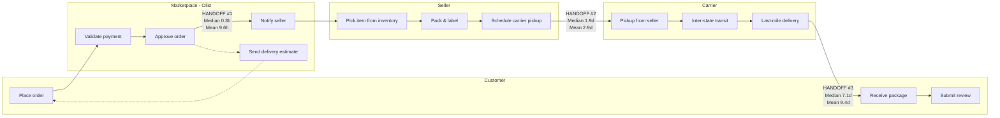
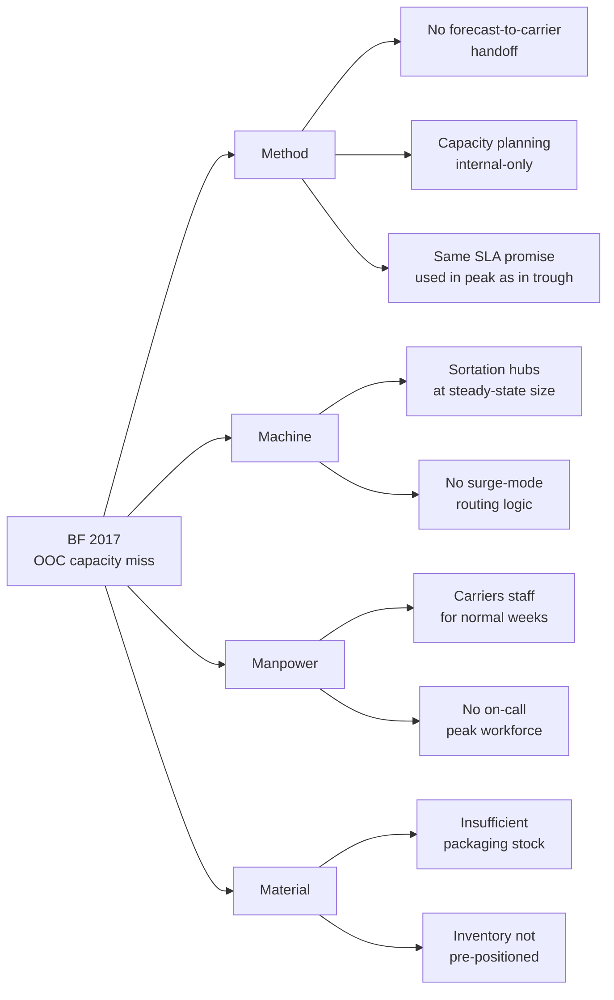
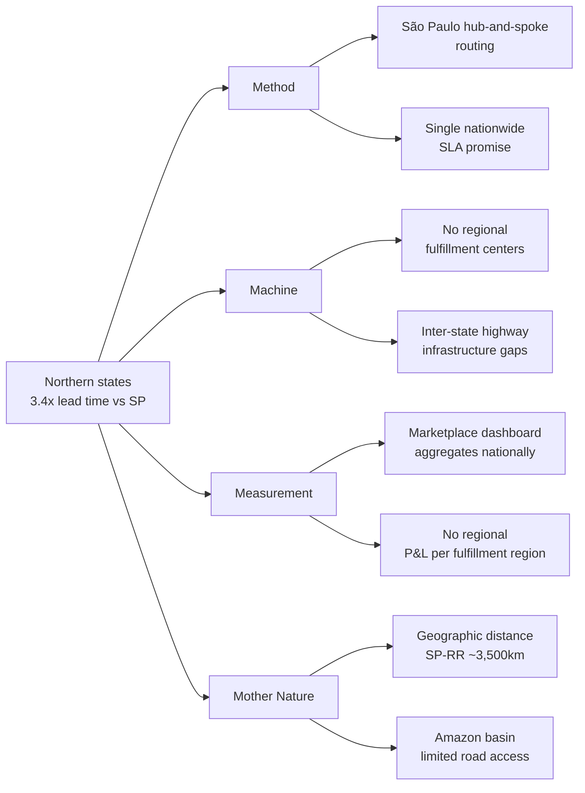
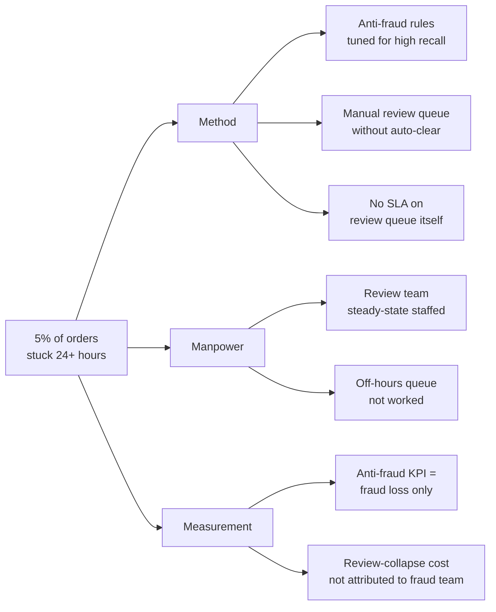
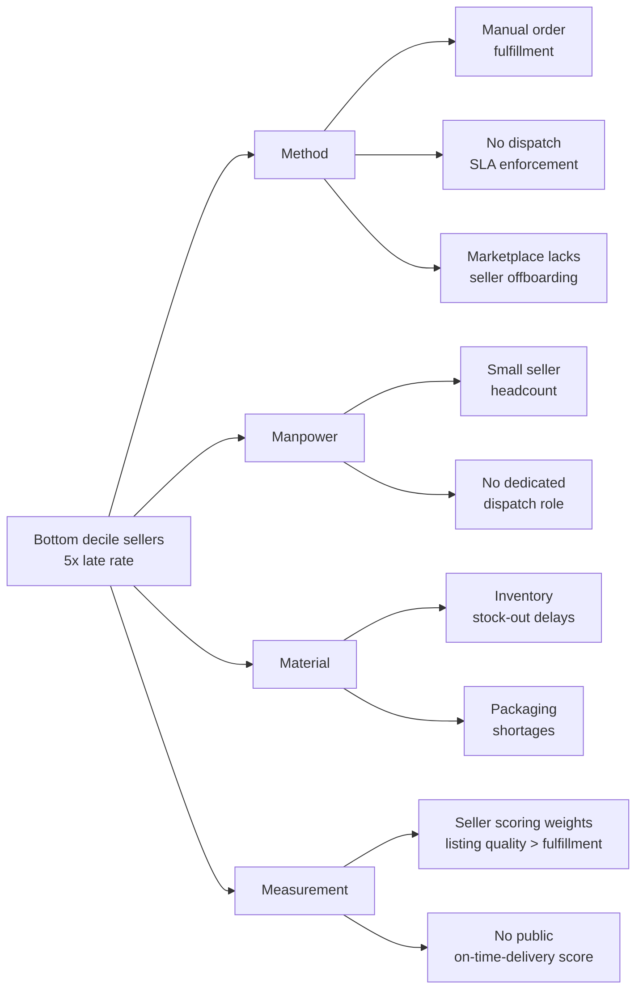

# Process Mapping & Root-Cause Analysis

This document delivers Tasks 1 and 3 of the brief: BPMN 2.0 swimlane mapping of the order-to-delivery flow, plus 5-Whys + Ishikawa (Fishbone) analysis for every Out-of-Control point identified by the SPC analysis.

---

## 1. BPMN 2.0 Swimlane Diagram — Order-to-Delivery Flow

The marketplace order-to-delivery flow has **four hand-off points**, each measurable in the data:

### Where the lead-time lags live

| Hand-off | Median | Mean | Std | Skew | OOC Diagnosis |
|---|---:|---:|---:|---:|---|
| #1 Marketplace approval | 0.3 hours | 9.6 hours | 19.1 h | 4.45 | **Bimodal:** 95% near-instant, 5% sit in queue 24+ hours |
| #2 Seller fulfillment | 1.9 days | 2.9 days | 3.5 d | 5.15 | **Long right tail:** bottom-decile sellers average 4-5d (vs top decile <1d) |
| #3 Carrier transit | 7.1 days | 9.4 days | 8.8 d | 4.50 | **Geographic:** Northern states (RR, AP, AM) >25 days vs SP <8 days |

**Interpretation.** Hand-off #3 (carrier transit) accounts for ~75% of total lead-time variance. It's not a single bottleneck — it's geography-driven, and individual states behave like separate processes that should be measured separately.

---

## 2. Out-of-Control Points and Root-Cause Analysis

The SPC analysis (log-transformed I-MR + p-chart) flagged 4 distinct OOC patterns. Each gets its own 5-Whys + Fishbone.

---

### OOC Pattern A: Black Friday 2017 — 7.3× volume spike

**Signal.** Daily order count on 2017-11-24 = 1,147 vs preceding-week mean = 158. Lead-time mean for that week jumped to 16+ days.

**5-Whys analysis:**

1. **Why** were so many orders late during Black Friday week? → Carriers couldn't process volume fast enough.
2. **Why** couldn't carriers process the volume? → Their capacity was sized for steady-state, not for a 7× spike.
3. **Why** were they sized for steady-state? → Marketplace doesn't share peak-volume forecasts with carriers.
4. **Why** doesn't the marketplace share forecasts? → No formal forecast-to-carrier handoff process exists.
5. **Why** does no such process exist? → **Root cause: capacity planning is an internal-only marketplace activity; carriers learn about volume after it arrives.**

**Fishbone (Ishikawa) — Black Friday capacity miss:**

**Recommended action:** Quarterly forecast-share with carrier partners; pre-position inventory to high-demand DCs 2 weeks before known events; activate surge SLA for week of event.

---

### OOC Pattern B: Northern States chronic underperformance

**Signal.** Roraima, Amapá, Amazonas, Pará, Maranhão, Acre all have mean lead times >20 days vs São Paulo's 8.8. Their late-rate is also 2-4× higher. Kruskal-Wallis confirms this is statistically significant (p < 1e-30), not noise.

**5-Whys analysis:**

1. **Why** do Northern states have such long lead times? → Carriers route packages through São Paulo regardless of destination.
2. **Why** do they route through São Paulo? → That's where the major distribution centers are.
3. **Why** are DCs concentrated in São Paulo? → 80% of order volume originates there; cost-per-package is lowest with centralized DCs.
4. **Why** does this cost optimization persist despite the service penalty? → No regional service-level KPI; everything is measured at marketplace-wide aggregate.
5. **Why** is there no regional KPI? → **Root cause: the marketplace's operational dashboard reports a single "% on-time" number, masking the 3.4× regional gap.**

**Fishbone — Northern States lead-time gap:**

**Recommended action:** Differentiate SLA promise by customer state (the SLA Reset scenario in the Excel engine). For 2-4× longer SLA promises in N. states, current 3.5% late-by-8d band drops to ~0%.

---

### OOC Pattern C: Approval queue tail (5% of orders sit 24+ hours)

**Signal.** Approval time has median 0.3h but mean 9.6h with skew 4.45. P95 is 45.8 hours.

**5-Whys analysis:**

1. **Why** do some orders take 24+ hours to approve? → They get stuck in the manual-review queue.
2. **Why** are they in manual review? → Anti-fraud rules flag them as suspicious.
3. **Why** are the anti-fraud rules flagging legitimate orders? → Rules are tuned for high recall (catch fraud), low precision (false positives accepted).
4. **Why** is the trade-off skewed that way? → Fraud loss per false-negative ($$ avg order value) >> cost per false-positive (delayed legitimate order).
5. **Why** does the model not consider customer-experience cost? → **Root cause: anti-fraud function optimizes ledger loss only; review-score collapse from delays is a downstream cost not visible to the anti-fraud team.**

**Fishbone — Approval queue tail:**

**Recommended action:** Add a queue-level SLA (e.g., 4-hour max time in manual review). Add downstream review-score-impact metric to anti-fraud team's dashboard.

---

### OOC Pattern D: Bottom-decile seller late rate

**Signal.** Among 202 high-volume sellers (100+ orders), late-delivery rate ranges from 5% to 24% — a 5× spread. This far exceeds common-cause variation; bottom decile is a structural quality issue.

**5-Whys analysis:**

1. **Why** do some sellers consistently deliver late? → They miss the carrier pickup window.
2. **Why** do they miss it? → Their dispatch process is manual and slow.
3. **Why** is dispatch slow? → No dedicated dispatch function; orders get packed when convenient.
4. **Why** is dispatch unstaffed? → Sellers are small; they prioritize new sales over fulfillment ops.
5. **Why** does the marketplace allow this? → **Root cause: marketplace seller-onboarding and seller-scoring don't include dispatch-discipline metrics; sellers can stay on the platform indefinitely with bad fulfillment if their listing quality is good.**

**Fishbone — Bottom-decile seller late rate:**

**Recommended action:** Mandatory dispatch SLA (e.g., carrier handoff within 2 days of approval). One-time training intervention for bottom 20 sellers (~R$500 each = R$10K total). Public on-time-delivery score on seller listings.

---

## 3. Linking back to Margin Preservation

The audit's central finding: **review score is the margin-preservation mechanism**. Each of the four OOC patterns above contributes to lateness, and lateness collapses reviews:

| Delay band | Mean review score | % 1-2 stars |
|---|---:|---:|
| On-time | **4.29** | 9% |
| Late 1-3 days | 3.84 | 21% |
| Late 4-7 days | 3.18 | 39% |
| **Late 8+ days** | **1.73** | **76%** |

A late-by-8+-days order is essentially a guaranteed return request, refund, and shipping penalty. The Excel engine quantifies the loss in BRL across four scenarios; the recommended Combined Intervention reduces preventable margin loss by ~90%.
